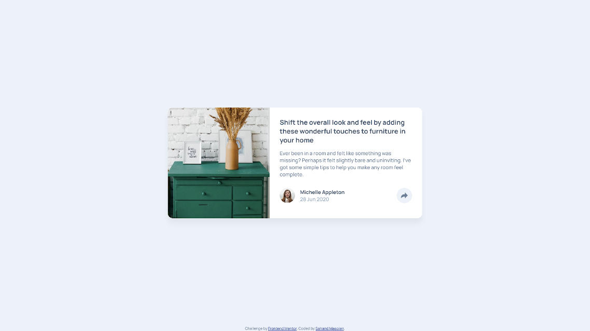
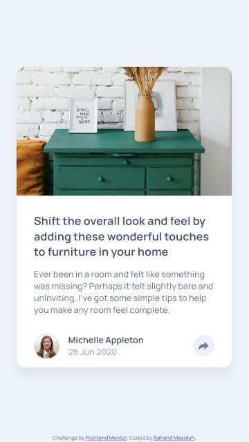
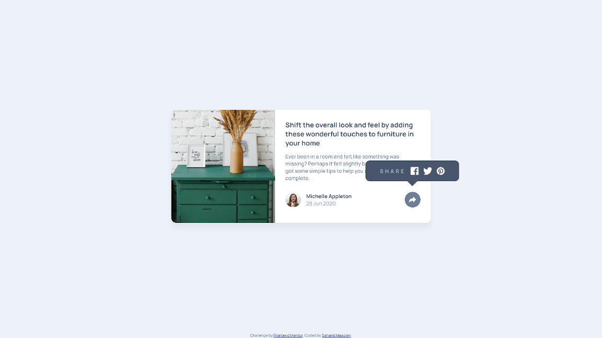
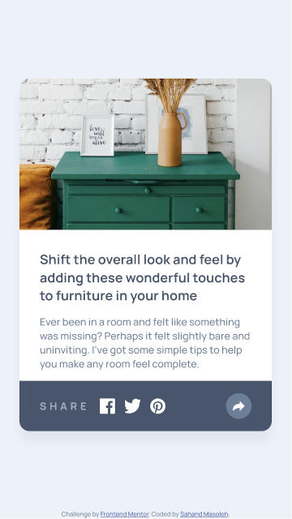

# Frontend Mentor - Article preview component solution

This is a solution to the [Article preview component challenge on Frontend Mentor](https://www.frontendmentor.io/challenges/article-preview-component-dYBN_pYFT). Frontend Mentor challenges help you improve your coding skills by building realistic projects.

## Table of contents

- [Overview](#overview)
  - [The challenge](#the-challenge)
  - [Screenshot](#screenshot)
  - [Links](#links)
- [My process](#my-process)
  - [Built with](#built-with)
- [Author](#author)

## Overview

### The challenge

Users should be able to:

- View the optimal layout for the component depending on their device's screen size
- See the social media share links when they click the share icon

### Screenshot

### Links

- Solution URL: [Github](https://github.com/sahand-masoleh/fem-10-article-preview-component)
- Live Site URL: [Add live site URL here](https://sahand-masoleh.github.io/fem-10-article-preview-component))

## My process

### Built with

- HTML
- CSS
- JavaScript

## Author

- Frontend Mentor - [@sahand-masoleh](https://www.frontendmentor.io/profile/sahand-masoleh)
- Twitter - [@SahandMasoleh](https://twitter.com/SahandMasoleh)
